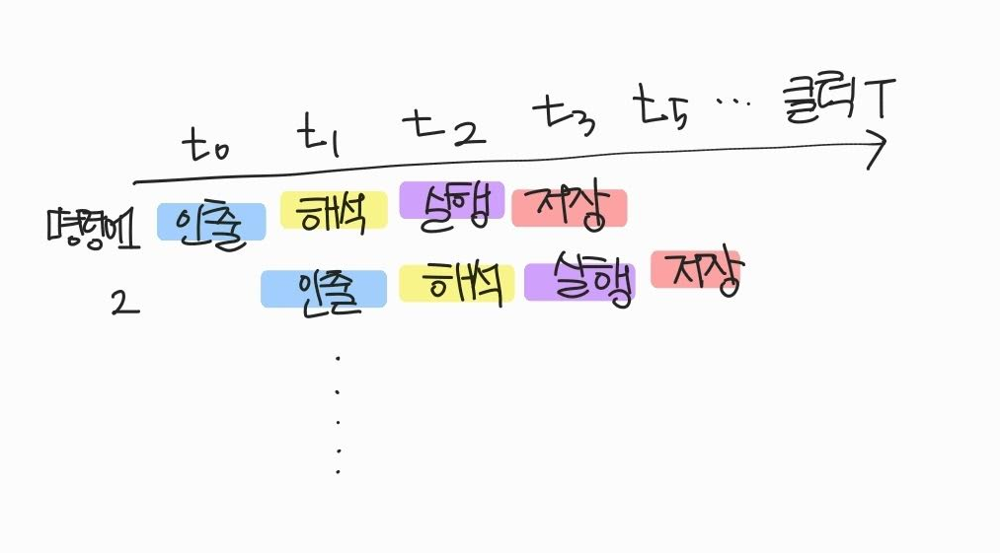

# 4장 CPU의 작동 원리

> ALU: 산술논리연산장치 - 계산만을 위해 존재하는 부품 \
> 제어장치: 제어신호를 내보내고 명령어를 해석하는 장치 \
> 레지스터: CPU 내부의 작은 임시 저장 장치, 프로그램을 실행하는데 필요한 값들을 임시로 저장한다.

## 1. ALU와 제어장치

### ALU

ALU가 받아들이고 내보는 정보

* ALU가 받아들이는 정보
  * ALU는 레지스터를 통해 피연산자를 받아들이고, 제어장치들로부터 수행할 연산ㅇ르 알려주는 제어신호를 받아들입니다.
* ALU가 내보내는 정보
  * 연산을 수행한 결과를 레지스터에 임시 저장
    * 레지스터에 임시 저장하는 이유: 연산할 때마다 메모리에 저장한다면, CPU의 메모리 접근 빈도가 증가하고 이는 프로그램의 실행 속도를 늦춘다.
  *   플래그(연산에 대한 추가적인 정보)를 플래그 레지스터에 별도로 저장

      | 플래그 종류    | 의미                              |
      | --------- | ------------------------------- |
      | 부호 플래그    | 연산한 결과의 부호를 나타낸다                |
      | 제로 플래그    | 연산 결과가 0인지 여부를 나타낸다             |
      | 캐리 플래그    | 연산 결과 올림수나 빌림수가 발생했는지 나타낸다      |
      | 오버플로우 플래그 | 오버플로우가 발생했는지 나타낸다.              |
      | 인터럽트 플래그  | 인터럽트가 가능한지 나타낸다.                |
      | 슈퍼바이저 플래그 | 커널모드로 실행중인지, 사용자모드로 실행중인지 나타낸다. |

### 제어장치

.png>)

제어장치가 받아들이고 내보내는 정보

* 제어장치가 받아들이는 정보
  * 클럭 신호
    * 클럭: 컴퓨터에서 연산을 조정하는 타이밍 신호
    * 클럭이 없다면? logic1\~3을 거쳐 output을 만드는 경우, input2는 input1이 모두 끝난 뒤 계산을 진행할 수 있다. 어느 시점에 input1의 각 단계가 끝나는지 알 수 없기 때문
  * 해석해야 할 명령어
    * 제어장치는 해당 명렁어를 해석하여 제어신호를 발생시켜 컴퓨터 부품들에게 수행해야 할 내용들을 알려준다.
  * 플래그
  * 제어버스로 전달된 제어신호
* 제어장치가 내보내는 정보
  * CPU 내부로 전달하는 제어신호
    * ALU에 수행할 연산을 지시하기 위해 - ALU로 제어신호 전송
    * 레지스터 간에 데이터를 이동시키거나, 레지스터에 저장된 명령어를 해석하기 위해 - 레지스터로 제어신호 전송
  * CPU 외부로 전달하는 제어신호
    * 메모리에 저장된 값을 읽거나, 메모리에 새로운 정보를 저장하고 싶을 때 - 메모리로 제어신호 전송
    * 입출력장치의 값을 읽거나, 입출력장치에 새로운 정보를 쓰고 싶을 때 - 입출력장치로 제어신호 전송

## 2. 레지스터

### 반드시 알아야 하는 레지스터의 종류

1. 프로그램 카운터, PC
   * 메모리에서 가져올 명령어의 주소
   * 명령어 포인터, IP로 불리는 경우도 있음
2. 명령어 레지스터, IR
   * 해석할 명령어를 저장하는 레지스터
3. 메모리 주소 레지스터, MAR
   * 메모리의 주소를 저장하는 레지스터
4. 메모리 버퍼 레지스터, MBR
   * 메모리와 주고받을 값을 저장하는 레지스터
   * 메모리 데이터 레지스터, MDR라고 불리는 경우도 있음
5. 플래그 레지스터
6. 범용 레지스터
   * 데이터와 주소를 모두 저장할 수 있는 레지스터
7. 스택 포인터
   * 스택의 꼭대기를 가리키는 레지스터
8. 베이스 레지스터

<figure><figcaption></figcaption></figure> <figure><figcaption></figcaption></figure> <figure><figcaption></figcaption></figure>

## 3. 명령어 사이클과 인터럽트

### 명령어 사이클

* 명령어 사이클
  * 프로그램속 각각의 명령어들은 일정한 주기가 반복되며 실행된다.
  * 인출 사이클 → 실행 사이클 → 인출 사이클 → …
    * 간접 주소 지정 방식의 경우 명령어를 실행하기 위해 메모리 접근을 한번 더 해야한다. ⇒ 간접 사이클 존재
* 인출 사이클
  * 메모리에 있는 명령어를 CPU로 가지고 오는 단계
* 실행 사이클
  * CPU로 가져온 명령어를 실행하는 단계

### 인터럽트

* 인터럽트
  * CPU의 정상적인 작업을 방해하는 신호
* 동기 인터럽트
  * CPU에 의해 발생하는 인터럽트
  * 명령어들을 수행하다가 예상치 못한 상황에 마주쳤을 때 발생 (예외 상황)
    * 폴트: 예외를 처리한 직후 예외가 발생한 명령어부터 실행을 재개하는 예외
    * 트랩: 예외를 처리한 직후 예외가 발생한 명령어의 다음 명령어부터 실행을 재개하는 예외
    * 중단: 실행중인 프로그램을 강제로 중단시킬 수 밖에 없는 심각한 오류를 발견했을때 발생하는 예외
    * 소프트웨어 인터럽트: 시스템 호출 발생
* 비동기 인터럽트 (하드웨어 인터럽트)
  * 주로 입출력장치에 의해 발생하는 인터럽트
  * 키보드, 마우스와 같은 입출력장치가 어떠한 입력을 받아들였을 때 이를 처리하기 위해 CPU에 인터럽트를 보낸다.

#### 하드웨어 인터럽트 처리 순서

1. 입출력장치는 CPU에 인터럽트 요청 신호를 보낸다.
2. CPU는 실행 사이클이 끝나고 명령어를 인출하기 전 항상 인터럽트 여부를 확인한다.
3. CPU는 인터럽트 요청을 확인하고 인터럽트 플래그를 통해 현재 인터럽트를 받아들일 수 있는지 여부를 확인한다.
4. 인터럽트를 받아들일 수 있다면 CPU는 지금까지의 작업을 백업한다.
5. CPU는 인터럽트 벡터를 참조하여 인터럽트 서비스 루틴을 실행한다.
   * 인터럽트 벡터: 인터럽트 서비스 루틴을 식별하기 위한 정보, 인터럽트 서비스 루틴의 시작점을 알 수 있다. (데이터버스를 통해 인터럽트 벡터를 전달받을 수 있다.)
   * 인터럽트 서비스 루틴: 인터럽트를 처리하기 위한 프로그램으로 인터럽트가 발생했을 때 해당 인터럽트를 어떻게 처리하고 작동해야 할지에 대한 정보로 이뤄짐, 인터럽트 핸들러
6. 인터럽트 서비스 루틴 실행이 끝나면 4에 백업해둔 작업을 복구하여 실행을 재개한다.

* 막을 수 있는 인터럽트
* 막을 수 없는 인터럽트
