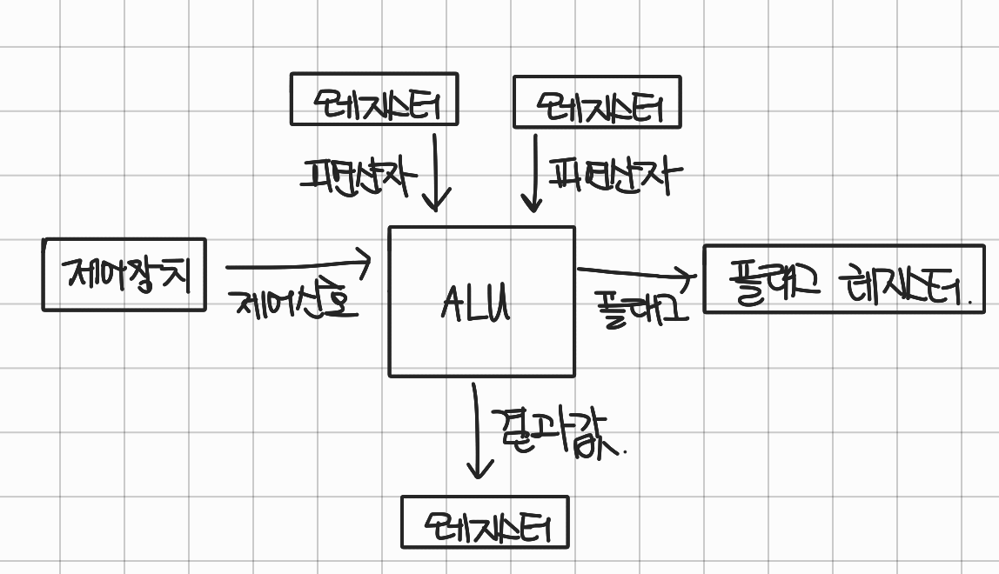

# 5장 CPU 성능 향상 기법

## 1. 빠른 CPU를 위한 설계 기법

### 코어와 멀티 코어

* 코어
  * CPU 내에서 명령어를 실행하는 부품&#x20;
* 멀티 코어
  * 코어를 여러개 포함하고 있는 CPU를 멀티코어 CPU 혹은 멀티코어 프로세서라고 한다.
  * 코어의  수와 성능이 항상 비례 관계인가?
    * 아니다, 사공이 많으면 배가 산으로 가듯이 코어마다 처리할 연산이 적절히 분배되는 것이 중요하다.

### 스레드와 멀티 스레드

* 스레드
  * 하드웨어적 스레드 (논리 프로세서)
  * 소프트웨어적 스레드
* 멀티스레드/하이퍼스레드

#### 하드웨어적 스레드

* 하나의 코어가 동시에 처리하는 명령어 단위
* 예시
  * 2코어 4스레드: 명령어를 실행하는 부품을 두개 포함하고, 한번에 4개의 명령어 처리 가능
  * 이처럼 하나의 코어로 여러 명령어를 동시에 처리하는 CPU를 멀티스레드 프로세스, 멀티스레드 CPU라고 칭함

#### 소프트웨어적 스레드

* 하나의 프로그램에서 독립적으로 실행되는 단위
* 예시
  * 1코어 1스레드 CPU도 소프트웨어적 스레드를 수십 개 실행 가능
  * 이유: 하나의 물리적 스레드를 컨텍스트 스위칭을 통해 여러 개의 소프트웨어적 스레드를 번갈아가며 실행하는 것이다.

#### 멀티스레드 프로세서

* 하나의 명령어를 처리하기 위해 필요한 레지스터 (프로그램 카운터, 스택 포인터, 메모리 버퍼 레지스터, 메모리 주소 레지스터 등)를 여러개 가지고 있다.
* 예시
  * 두 개의 레지스터 세트를 가지고 있는 멀티스레드 프로세서의 경우, A 명령어를 실행하기 위한 레지스터 세트  B 명령어를 실행하기 위한 레지스터 세트를 각각 가지고 있기에 하나의 코어에서 두개의 명령어가 동시에 실행되거나 교차 실행될 수 있다.

## 2. 명령어 병렬 처리 기법

### 명령어 파이프라인

* 동시에 여러개의 명령어를 겹쳐 실행하는 기법

1. 명령어 인출, instruction fetch
2. 명령어 해석, instruction decode
3. 명령어 실행, execute instruction
4. 결과 저장, write back

<figure><figcaption></figcaption></figure>

### 파이프라인 위험

* 성능 향상에 실패하는 상황을 파이프라인 위험이라고 한다
* 데이터 위험
  * 데이터 의존성에 의해 발생
  * 데이터 의존적인 두 명령어를 동시에 실행하려고 하면 파이프라인이 제대로 동작하지 않는다.
* 제어 위험
  * 분기 등으로 인한 프로그램 카운터의 갑작스러운 변화에 의해 발생
  * 현재 실행 중인 명령어의 다음 주소로 갱신되고 있지만, 갑작스러운 분기 요청으로 인해 아예 다른 주소로 이동할 시 잘못 인출된 명령어는 무효가 되어 파이프라인을 비우고(flush), 실행을 재시작해야 하므로 성능 저하가 발생한다.
    * 해결책: 분기 예측
* 구조적 위험 (자원위험)
  * 명령어를 겹쳐 실행하는 과정에서 서로 다른 명령어가 동시에 ALU, 레지스터 등과 같은 CPU 부품을 사용하려고 할 때 발생

### 슈퍼스칼라

* CPU 내부에 여러 개의 명령어 파이프라인을 포함한 구조
* 슈퍼스칼라 프로세서, 슈퍼스칼라 CPU
  * 슈퍼스칼라 구조로 명령어 처리가 가능한 CPU

<figure><figcaption></figcaption></figure>
